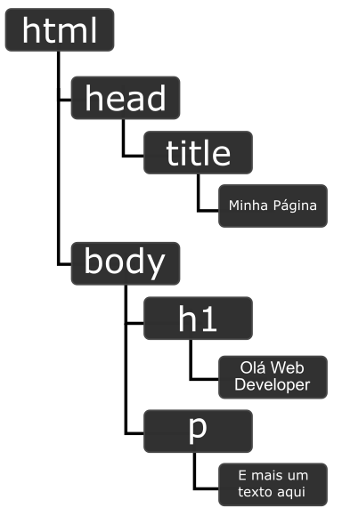

# Projeto Web Components

Pasta de exercicícios para o curso Trabalhando com Web Components no Front-end da [DIO](https://dio.me/), com o tutor **Felipe Aguiar**

## O que aprendi

Nesse curso aprendi um pouco sobre a mecanica dos Frameworks e aprendi criar meus próprios Web Components

## Tecnologias Usadas

- HTML
- CSS
- JavaScript

###  **O que é HTML**

HTML (HiperText Markup Language) é uma linguagem de marcação utilizada na construção de páginas na Web.
Os documentos HTML podem ser interpretados diretamente pelos navegadores

###  **O que é CSS**

CSS (Cascading Style Sheets) é uma linguagem de estilo utilizada para estilizar documentos HTML, o css pode ser aplicado inline, internamente ou externamente.

###  **O que é JavaScript**

JavaScript é uma linguagem de programação de alto nível. Ela é utilizada principalmente para criar páginas web interativas e dinâmicas

###  **O que são Web Elements?**

A **DOM (Document Object Model )** é uma estrutura em formato de árvore que os navegadores utilizam para representar as páginas em HMTL na web.

Mesmo a DOM sendo muito parecida com o nosso código ela não é a mesma coisa.

O **Shadow DOM** é uma tecnologia do <u>navegador</u> com a qual podemos criar componentes sem influenciar os demais elementos a sua volta.

O Shadow DOM nos permite criar elementos que possuem estrutura, estilo e comportamento encapsulados.

**Virtual DOM (VDOM)**. Ele é uma representação do DOM mantida em memória. Assim, quando precisamos fazer alguma alteração, ela é feita no Virtual DOM, que é bem mais rápido que o DOM. Com isso ele analisa todos os lugares que serão afetados e sincroniza com o DOM em um processo chamado Reconciliação. A vantagem disso é que essa análise permite que haja o menor número possível de acessos ao DOM, melhorando muito a performance das aplicações.

Lembrando que o Virtual DOM não é algo do navegador, e sim, um conceito implementado por <u>bibliotecas</u> como o React.

### Um componente pode ser criado atravéz do conceito de Shadow-DOM

Neles podemos ter

<ol>
<li>HTMLs</li>
<li>Estilo CSS</li>
<li>Propridades para torna-lo dinânmico</li>
</ol>

Você passa as Propriedades para configurar o elemento e este pode ser chamado atráves de seu seletor.